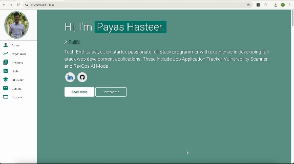

# ECE 444-2024 PRA 1
#### Name: Payas Hasteer 
#### Student Number: 1006823751

#### This repository is a clone of the following Github Repository:
> [Github Repository](https://github.com/varadbhogayata/varadbhogayata.github.io)

# Personal Portfolio ⚡️ 
> A clean, beautiful, responsive portfolio template for Software Developers!

### Website Preview - Activity 2

 
  <kbd>
    
  </kbd>

### Website Preview - Activity 3

 
  <kbd>
    
  </kbd>

## Features 📋
⚡️ Fully Responsive\
⚡️ Mobile View Friendly\
⚡️ Valid HTML5 & CSS3\
⚡️ Typing animation using `Typed.js`\
⚡️ Easy to modify

## Sections 📚
✔️ About me\
✔️ Experience\
✔️ Projects \
✔️ Skills \
✔️ Education\
✔️ Contact Info\
✔️ Resume

To view a live example, **[click here](https://hasteerp.github.io/)**

## Tools Used 🛠️
* [<b>GitHub Pages</b>](https://create-react-app.dev/docs/deployment/#github-pages) - To host my static website (HTML, CSS, JS).
* [<b>Materialize</b>](https://materializecss.com/) - A CSS framework to get Google's Material Design components.
* [<b>Typed.js</b>](https://mattboldt.com/demos/typed-js/) - JavaScript Library
